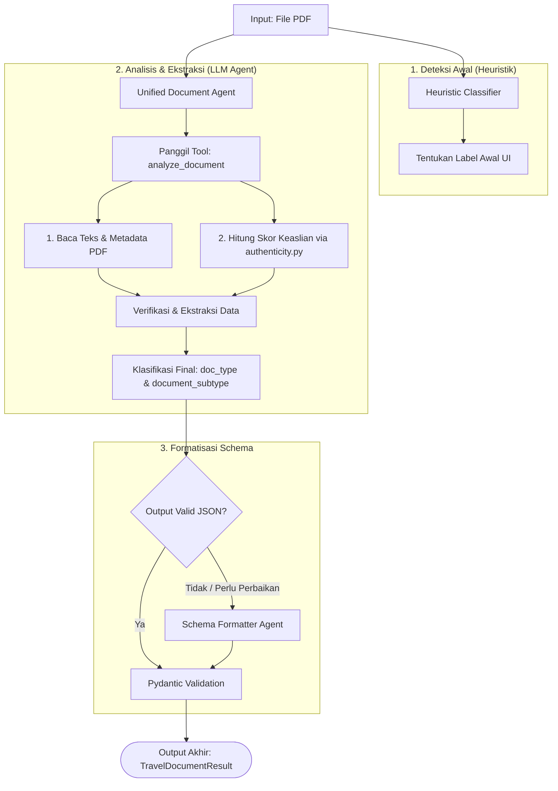

# Agents Module (Baca Invoice)

Modul ini berisi agen pintar berbasis **Google ADK (Agent Development Kit)** yang bertugas melakukan ekstraksi informasi dan verifikasi dokumen perjalanan secara terpadu.

---

## 🗺️ Alur Kerja Agen (Agent Flow)

Seluruh tipe dokumen diproses secara terpadu oleh **Unified Document Agent**. Berikut adalah diagram alur proses dokumen dari saat diunggah hingga menghasilkan data JSON terstruktur yang telah tervalidasi:

---

## 🤖 Agen-Agen yang Aktif

### 1. Unified Document Agent (`document_agent`)
*   **File**: [document.py](file:///Users/win/Documents/code/pinter/invoice_agent/invoice_verifier/baca_invoice/agents/document.py)
*   **Tugas**: Menggantikan 4 agen khusus sebelumnya. Agen tunggal ini bertugas membaca dokumen PDF, menganalisis indikator keaslian metadata, dan melakukan ekstraksi data untuk seluruh kategori dokumen (tiket pesawat, invoice hotel, invoice umum, dan receipt).
*   **Prompt**: `DOCUMENT_AGENT_PROMPT` di [prompts.py](file:///Users/win/Documents/code/pinter/invoice_agent/invoice_verifier/baca_invoice/agents/prompts.py)
*   **Tool**: [analyze_document](file:///Users/win/Documents/code/pinter/invoice_agent/invoice_verifier/baca_invoice/tools/combined.py)

### 2. Schema Formatter Agent (`travel_document_schema_formatter`)
*   **File**: [formatter.py](file:///Users/win/Documents/code/pinter/invoice_agent/invoice_verifier/baca_invoice/agents/formatter.py)
*   **Tugas**: Bertindak sebagai *guardrail* pasca-pemrosesan. Agen ini bertugas menormalisasi dan memformat ulang JSON hasil ekstraksi mentah agar mengikuti format Pydantic `TravelDocumentResult`.
*   **Output**: JSON yang siap divalidasi oleh class Pydantic dengan pengisian nilai default (`"-"`, `0.0`, `[]`, dsb.) jika ada field wajib yang kosong.

---

## 🗄️ Agen yang Dinonaktifkan (Backup)

Folder [deprecated/](file:///Users/win/Documents/code/pinter/invoice_agent/invoice_verifier/baca_invoice/agents/deprecated/) menyimpan agen spesifik sebelumnya yang telah dinonaktifkan:
*   `flight_ticket_agent`
*   `hotel_invoice_agent`
*   `invoice_agent`
*   `receipt_agent`

---

## 🛠️ Tool yang Digunakan

Unified Document Agent dilengkapi dengan tool **`analyze_document`**:
1.  **Ekstraksi Konten & Metadata**: Membaca file PDF menggunakan PyMuPDF (`fitz`), mengambil teks halaman pertama (hingga 3000 karakter), serta metadata file.
2.  **Analisis Keaslian (Authenticity)**: Mendeteksi keaslian dokumen sesuai aturan di [authenticity.py](file:///Users/win/Documents/code/pinter/invoice_agent/invoice_verifier/baca_invoice/tools/authenticity.py):
    *   Penggunaan software pengeditan (Adobe Acrobat, Canva, Illustrator, dsb.).
    *   Metadata creator/producer yang tidak sesuai dengan provider (Traveloka, Tiket.com, dsb.).
    *   Tanggal modifikasi dokumen pasca-pembuatan.
    *   Metadata sengaja dihapus/dikosongkan.

---

## 📋 Aturan Output & Validasi

Unified Document Agent dipandu oleh instruksi seragam (`UNIFIED_OUTPUT_RULES`) di [prompts.py](file:///Users/win/Documents/code/pinter/invoice_agent/invoice_verifier/baca_invoice/agents/prompts.py):
*   **Keaslian**: Field `authenticity` harus disalin mentah-mentah dari output tool tanpa modifikasi.
*   **Kepercayaan Ekstraksi (`extraction_confidence`)**: Dihitung berdasarkan proporsi field penting yang berhasil diekstraksi.
*   **Review Manual (`requires_manual_review`)**: Diset otomatis ke `true` apabila keaslian mencurigakan, nilai pembayaran > Rp10.000.000, atau terdapat teks krusial yang rusak.
